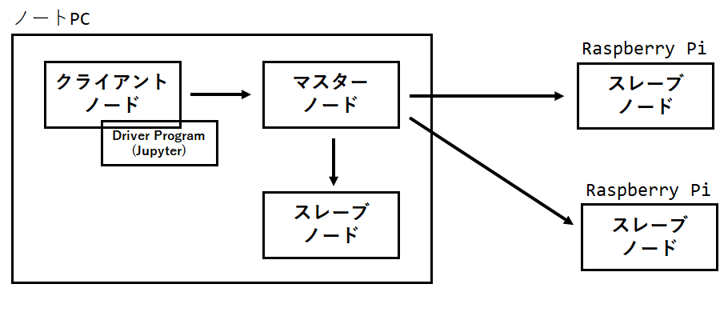
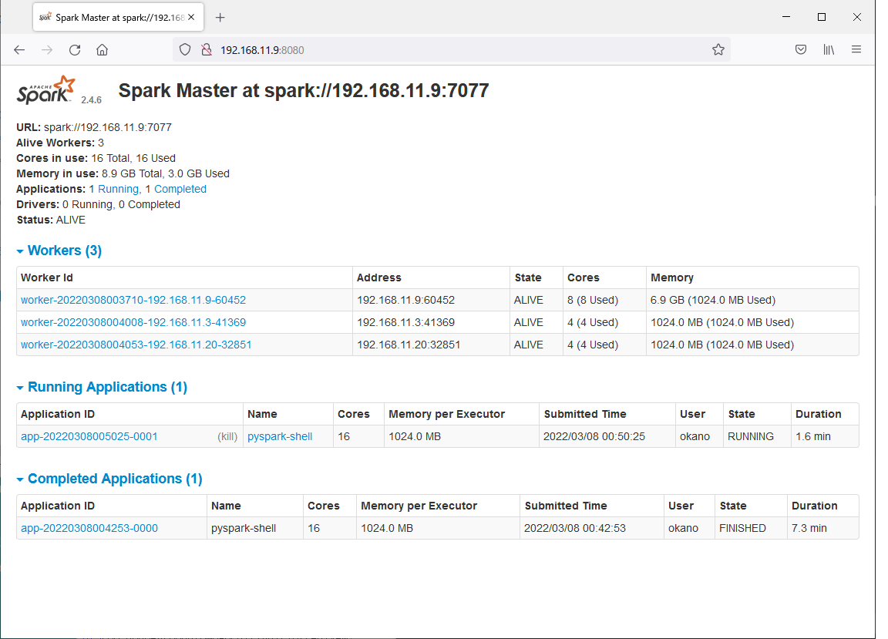

# switch-bot-meter-pyspark

## 概要

SwitchBot温湿度計で取得した温度をPySpark、pandasを
使用してグラフ化。

## 実行環境

Standaloneクラスタモードで起動したSparkにJupyterで接続。

### マシン構成

|マシン|役割|
|:----|:---|
|ノートPC|クライアントノード マスターノード スレーブノード|
|Raspberry Pi|スレーブノード|
|Raspberry Pi|スレーブノード|

構成図

Web UI

## 参考文献

アプリケーションエンジニアのためのApache Spark入門 
https://www.shuwasystem.co.jp/book/9784798053776.html